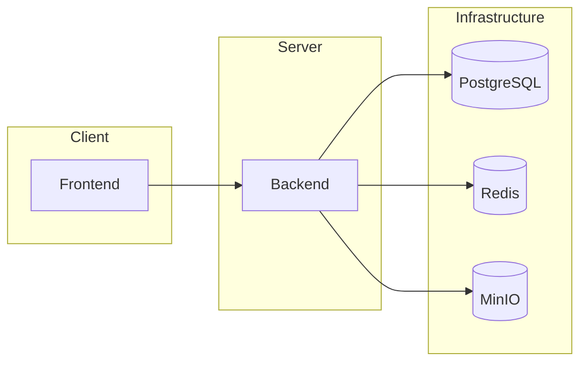

# ☁️ Cloud File Storage

**Cloud File Storage** — это многопользовательское файловое облако. 
Пользователи сервиса могут использовать его для загрузки и хранения файлов.

---

## 🚀 Функционал

- Регистрация и авторизация пользователей
- Работа с файлами и папками:
  - Загрузка, скачивание, удаление
  - Перемещение и переименование
  - Создание пустых папок
  - Поиск по имени
- Swagger UI для REST API-документации

---
## 🛠️ Технологический стек

- **Backend**: Java 17, Spring Boot (Web, Security, Data JPA, Validation, Session)
- **База данных**: PostgreSQL
- **Хранение сессий**: Redis
- **Файловое хранилище**: MinIO (S3-совместимое)
- **Маппинг DTO ↔ Entity**: MapStruct
- **Контейнеризация**: Docker, Docker Compose

---

## 🏗️ Архитектура

Проект построен по архитектуре **client–server** с использованием дополнительных инфраструктурных сервисов.



- **Frontend** — веб-интерфейс, взаимодействует с Backend через REST API (используется готовое приложение  из внешнего репозитория - <a href="https://github.com/zhukovsd/cloud-storage-frontend/">frontend</a>)
- **Backend (Spring Boot)** — серверная логика: аутентификация, работа с файлами, управление пользователями
- **PostgreSQL** — хранение информации о пользователях
- **Redis** — хранение пользовательских сессий 
- **MinIO** — объектное файловое хранилище
---

## 📦 Запуск проекта

### Требования
- Git
- Docker + Docker Compose
- Java 17+ (если планируете запускать backend локально)

#### 1. Склонируйте репозиторий
```bash
git clone https://github.com/VladislavGav/cloud-file-storage.git
```

#### 2. Откройте проект в IntelliJ IDEA

#### 3. Создайте файл `.env` в корне проекта

Пример содержимого:
 ```
POSTGRES_DB=storage_db
POSTGRES_USER=admin
POSTGRES_PASSWORD=pass

MINIO_BUCKET=user-files
MINIO_URL=http://localhost:9000
MINIO_ACCESS_KEY=admin
MINIO_SECRET_KEY=pass

REDIS_HOST=localhost
REDIS_PORT=6379
```
#### 4. Запустите приложение

Вариант 1: Запуск всего приложения через Docker Compose
```bash
docker compose up -d
```
При первом запуске Docker создаст и запустит контейнеры:
1. postgres — реляционная база данных PostgreSQL
2. redis — хранилище для сессий и кэша
3. minio — объектное файловое хранилище
4. backend — серверная часть на Spring Boot
5. frontend — клиентская часть (React + Nginx)

Вариант 2: Запуск backend локально
1. Поднимите инфраструктуру (Postgres, Redis, MinIO, Frontend):
```bash
docker compose -f compose.dev.yaml up -d
```
2. Запустите backend локально из IntelliJ IDEA

## 🔗 Доступные сервисы

- Frontend: http://localhost:3000
- Swagger UI: http://localhost:8080/swagger-ui/index.html
- MinIO Console: http://localhost:9090
